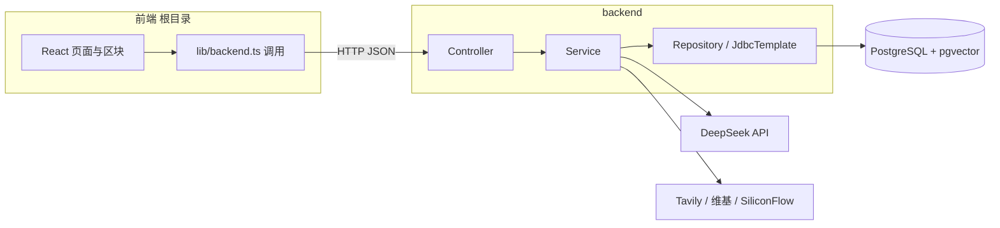

# 智能 PPT 生成站

前后端分离：**React（Vite）单页应用** + **Spring Boot** REST API。用户输入主题或文档后，后端调用 **DeepSeek** 生成大纲与每页要点，**Tavily / 维基** 与 **SiliconFlow 向量** 完成外部检索与事实抽检，数据落在 **PostgreSQL + pgvector**。

---

## 1. 架构总览



- **ILF-1**：项目、幻灯片实体（JPA）  
- **ILF-2**：`index_segments` 文本块 + 向量（`IndexSegmentService`，文档/外部检索均写入此表）  
- **ILF-3**：`evaluation_reports` 人工与自动评估（`EvaluationReportService`）

---

## 2. 目录与主要文件（做什么）

| 位置 | 作用 |
|------|------|
| **根目录** |  |
| `package.json` / `vite.config.ts` | 前端依赖、Vite 构建与开发服务器（默认 5173） |
| `src/main.tsx` | React 入口 |
| `src/App.tsx` | 主流程路由与步骤：首页 → 输入 → 大纲 → 内容 → 预览 → 评估等；聚合 `lib/backend` 的 API |
| `src/lib/backend.ts` | 与后端 `http://localhost:8080` 通信的 axios 封装（项目、大纲、幻灯片、外部源、评估等） |
| `src/lib/api.ts` | 占位说明：前端不直连第三方 LLM，统一走后端 |
| `src/sections/*` | 各功能区块：`InputSection` 输入主题/文档，`OutlineSection` 大纲编辑，`ContentSection` 内容，`PreviewSection` 预览与加载外部知识，`EvaluationSection` 评估报告，`SystemConfigSection` 系统配置等 |
| `src/pages/SlideDetailView.tsx` / `KnowledgeSearchPage.tsx` | 单页详情、知识检索页 |
| `src/components/ui/*` | 基于 Radix 的 UI 组件 |
| `dist/` | `npm run build` 产出（可静态部署） |
| `docker-compose.yml` | 一键启动带 **pgvector** 的 PostgreSQL（推荐） |
| `env.example` | 环境变量模板（复制为 `.env` 自行填写，勿提交） |
| `scripts/acceptance-test.ps1` | 三条章程主题的自动化验收脚本（需后端已启动） |
| **backend/** |  |
| `pom.xml` | Maven：Java 21、Spring Boot 3.3.x |
| `PptBackendApplication.java` | Spring Boot 入口 |
| `resources/application.yml` | 默认数据源、端口 8080、`deepseek` / `tavily` / `siliconflow` 占位（密钥走环境变量） |
| `resources/application-local.yml` | `local` profile 下的本地调试（如开启 SQL 日志） |
| `resources/schema.sql` | 参考 DDL（含 `vector` 扩展与 `index_segments`）；首次需数据库具备 pgvector |
| `controller/*` | REST：`ProjectController` 项目/主题/文档/生成幻灯片；`EvaluationReportController` 评估；`ExternalSourceController` 外部检索加载；`IndexSegmentController` 索引段；`SystemConfigController` 配置；`HealthController` 健康检查 |
| `service/*` | 业务：`OutlineGenerationService` / `SlideGenerationService`（DeepSeek）；`ExternalKnowledgeSourceService`（Tavily + 维基）；`EmbeddingService` + `SiliconFlowEmbeddingClient`；`IndexSegmentService`（向量写入与检索）；`FactConsistencyService` + `AutoEvaluationScoringService`（事实率与自动分）；`DocumentIndexingService` / `DocumentTextExtractionService`（文档入库） |
| `model/*` / `repository/*` | JPA 实体与仓储（项目、幻灯片、评估报告、系统配置等） |
| `config/CorsConfig.java` | 允许前端域访问 API |
| `config/GlobalExceptionHandler.java` | 统一异常响应 |

---

## 3. 运行前依赖（必装 / 建议）

### 3.1 本机软件

| 依赖 | 版本建议 | 用途 |
|------|-----------|------|
| **Node.js** | 20.x | 前端 `npm install` / `npm run dev` |
| **JDK** | 21 | 后端 Maven 编译与运行 |
| **Maven** | 3.9+ | `backend` 下 `mvn` |
| **PostgreSQL + pgvector** | 与 JDBC 兼容即可 | 存储业务数据与向量；**必须能执行** `CREATE EXTENSION vector` |
| Docker Desktop（可选） | — | 使用仓库内 `docker-compose.yml` 启动数据库最省事 |

### 3.2 外部服务与密钥（配置方式）

所有密钥建议通过 **环境变量** 注入（不要把真实 Key 写进仓库）。可复制根目录 `env.example` 为 `.env`，在 PowerShell 中加载后再启动后端（或直接在终端 `set` / `$env:XXX=`）。

| 变量 / 配置项 | 是否必需 | 说明 |
|----------------|-----------|------|
| **`DEEPSEEK_API_KEY`**（或 `deepseek.api-key`） | **生成大纲与幻灯片时必需** | 调用 DeepSeek Chat Completions |
| **`TAVILY_API_KEY`** | 可选 | 无则外部检索主要依赖维基兜底 |
| **`SILICONFLOW_API_KEY`** | 可选 | 无则向量用本地确定性伪向量；**语义事实率**会退化为词重叠启发式 |
| **数据库连接** | 必需 | 默认见 `application.yml`：`jdbc:postgresql://localhost:5432/ppt_ai`，用户 `ppt_user`，密码 `ppt_password` |

可选覆盖（见 `application.yml`）：`TAVILY_SEARCH_DEPTH`、`TAVILY_MAX_RESULTS`、`TAVILY_TIMEOUT_SECONDS`、`TAVILY_WIKIPEDIA_MODE`（`supplement` 在 Tavily 后再合并中文维基）。

### 3.3 前端指向后端

默认 `src/lib/backend.ts` 使用 `import.meta.env.VITE_API_BASE ?? 'http://localhost:8080'`。若后端不在本机 8080，在项目根目录新建 `.env.development.local`：

```bash
VITE_API_BASE=http://你的后端地址:端口
```

---

## 4. 从零运行：Windows CMD 版

### 步骤 0：安装基础软件（只需做一次）

| 软件 | 下载地址 | 安装后验证命令 |
|------|----------|---------------|
| **Git** | https://git-scm.com/download/win | `git --version` |
| **Node.js 20.x** | https://nodejs.org/dist/v20.18.0/node-v20.18.0-x64.msi | `node -v` 和 `npm -v` |
| **JDK 21** | https://adoptium.net/zh-CN/temurin/releases/?version=21 | `java -version` |
| **Maven 3.9+** | https://maven.apache.org/download.cgi（下载 `apache-maven-3.9.x-bin.zip`，解压到 `C:\apache-maven`） | `mvn -v` |
| **Docker Desktop** | https://www.docker.com/products/docker-desktop | `docker --version` |

**Maven 环境变量配置（如果 `mvn -v` 报错）：**
1. 右键"此电脑" → 属性 → 高级系统设置 → 环境变量
2. 在"系统变量"里新建 `MAVEN_HOME`，值为 `C:\apache-maven`
3. 编辑 `Path`，新建一行，填入 `%MAVEN_HOME%\bin`
4. 重新打开 CMD，再试 `mvn -v`

---

### 步骤 1：获取项目代码

如果你已有项目文件夹（比如从压缩包解压的），直接 `cd` 进去即可。否则：

```cmd
cd C:\Users\你的用户名\Desktop
git clone 你的仓库地址.git
cd PPT-ai-generated
```

**确认成功**：`dir` 命令能看到 `backend` 文件夹、`package.json`、`docker-compose.yml` 等文件。

---

### 步骤 2：启动数据库（Docker）

确保 Docker Desktop 已经在任务栏运行（右下角鲸鱼图标是绿色的）。

```cmd
cd 你的项目根目录
docker compose up -d
```

**确认成功**：
```cmd
docker ps
```
你应该看到名为 `postgres` 或 `ppt-ai-db` 的容器在运行，状态是 `Up`。

> 如果你不想用 Docker，也可以自行安装 PostgreSQL 并手动创建 `ppt_ai` 数据库，再执行 `backend/src/main/resources/schema.sql`。但 Docker 是最省事的方案。

---

### 步骤 3：检查 API 密钥配置（关键）

**绝对不要把密钥写进 `application.yml` 或代码里。** 请打开文件：

```cmd
notepad backend\src\main\resources\application.yml
```

找到 `tavily:` 和 `siliconflow:` 配置段，确保它们长这样（**值是占位符，不是明文 key**）：

```yaml
tavily:
  api-key: ${TAVILY_API_KEY:}

siliconflow:
  api-key: ${SILICONFLOW_API_KEY:}
```

如果里面有明文 key，请改成上面的占位符形式，保存关闭。

---

### 步骤 4：设置环境变量并启动后端

在同一个 CMD 窗口中，逐行执行（把 `sk-...` 换成你真实的 key）：

```cmd
set DEEPSEEK_API_KEY=sk-你的DeepSeekKey
set TAVILY_API_KEY=tvly-你的TavilyKey
set SILICONFLOW_API_KEY=sk-你的SiliconFlowKey
```

**确认变量已写入**：
```cmd
echo %DEEPSEEK_API_KEY%
```
如果回显是你的 key，说明生效了。

> **注意**：`set` 只对**当前 CMD 窗口**有效。如果你关掉窗口重开，需要重新执行上面 3 条 `set`。

启动后端：

```cmd
cd backend
mvn spring-boot:run
```

**确认成功**：看到类似 `Started PptBackendApplication in x.x seconds` 的日志，且没有 `BindingException` 或 `Connection refused` 报错。

保持这个窗口运行，**不要关闭**。

---

### 步骤 5：启动前端

**新开一个 CMD 窗口**（在文件夹空白处按住 `Shift + 右键` → "在此处打开命令窗口"，或重新打开 CMD 并 `cd` 到项目根目录）。

```cmd
cd 你的项目根目录
npm install
```

**确认成功**：没有 `ERR!` 红色报错，最后显示 `added xxx packages`。

```cmd
npm run dev
```

**确认成功**：显示 `Local: http://localhost:5173/`。

保持这个窗口运行，**不要关闭**。

---

### 步骤 6：验证整个系统

打开浏览器，访问以下地址：

| 地址 | 应该看到 |
|------|----------|
| http://localhost:8080/actuator/health | `{"status":"UP"}` |
| http://localhost:5173 | 前端首页，能输入主题 |

在前端页面测试：
1. 输入主题，例如 `人工智能在医疗中的应用`
2. 点击生成，等待大纲出现
3. 进入预览页，确认能看到内容
4. 提交评估，查看评估报告中的"事实准确率（自动）"是否有数值

---

### 步骤 7（可选）：三条主题验收

后端和前端都启动后，再开一个 CMD：

```cmd
cd 你的项目根目录
powershell -ExecutionPolicy Bypass -File .\scripts\acceptance-test.ps1
```

> 如果提示 `powershell` 不是内部命令，说明你的系统禁用了 PowerShell，可以跳过这步，手动在前端测试三个主题。

---

## 5. 常见问题（CMD 版）

| 现象 | 原因 | 解决 |
|------|------|------|
| `'mvn' 不是内部或外部命令` | Maven 没加 PATH | 按步骤 0 配好 `MAVEN_HOME` 和 `Path`，重开 CMD |
| `'docker' 不是内部或外部命令` | Docker Desktop 没装或未启动 | 安装并启动 Docker Desktop |
| `Failed to configure a DataSource` | 数据库没启动或密码不对 | 确认 `docker ps` 有 Postgres；检查 `application.yml` 里的密码 |
| `API key is missing` / 大纲生成失败 | 环境变量没设置 | 在当前 CMD 执行 `set DEEPSEEK_API_KEY=...` |
| `Port 8080 was already in use` | 8080 被占用 | `set SERVER_PORT=8081`，再启动后端；前端 `backend.ts` 里的地址也要同步改 |
| `Port 5173 was already in use` | 5173 被占用 | `npm run dev -- --port 5174` |

---

**安全提醒**：`.env` 文件、`application.yml`、聊天记录里都不要放明文 API Key。如果已经泄露，请立即去服务商后台 Revoke 并重新生成。

---

## 5. 构建与静态资源

```powershell
npm run build
```

产出在 `dist/`。后端也可单独打包：`cd backend && mvn -q package`，生成 `target/*.jar`。

---

## 6. 常见问题

- **数据库报错找不到 `vector` 类型**：当前 PostgreSQL 未安装 pgvector，请换用 `pgvector/pgvector` 镜像或安装扩展。  
- **大纲/幻灯片报错缺密钥**：设置 `DEEPSEEK_API_KEY` 后重启后端。  
- **端口占用**：修改 `application.yml` 的 `server.port` 或关闭占用 8080 / 5173 的进程。  
- **前端连不上后端**：检查 `VITE_API_BASE`、防火墙与后端是否启动。

---

## 7. 许可证与说明

本项目用于课程/综合实践；第三方 API（DeepSeek、Tavily、SiliconFlow）需遵守各自服务条款与计费规则。
